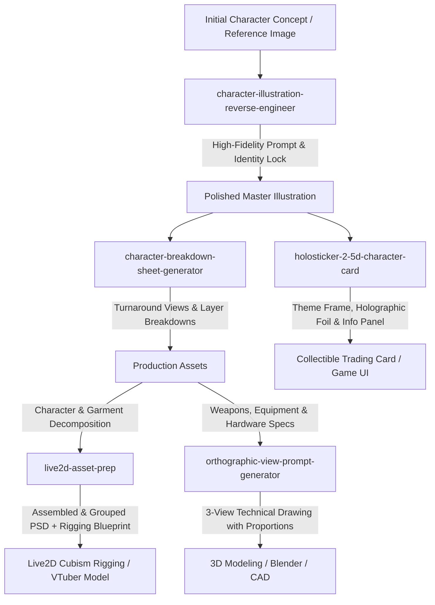

# 🎨 AI Character & Visual Production Skills Suite

[](https://github.com/)
[](https://github.com/)
[](LICENSE)
[](SKILL.md)

A curated suite of specialized **AI Agent Skills** and structured prompt engineering systems designed for anime character illustration, concept art decompilation, Live2D Cubism rigging preparation, collectible trading cards, and precision 3D orthographic multi-view technical sheets.

Compatible with **Google Antigravity**, **Claude Code**, **Claude Desktop**, **Cursor**, and leading image generation platforms (**Midjourney**, **Flux**, **Stable Diffusion**, **DALL-E 3**).

---

## 🧭 Skills Catalog

| Skill Folder | Description | Primary Deliverables | Target Tools & Workflows |
|---|---|---|---|
| [**`character-breakdown-sheet-generator`**](./character-breakdown-sheet-generator/) | Generates character model sheets, turnaround views (front/side/back), and decomposed layer callouts. | Structured prompt + layout plan + consistency controls | Midjourney, SDXL, Flux, 3D Modeler handoff |
| [**`character-illustration-reverse-engineer`**](./character-illustration-reverse-engineer/) | Deconstructs character artwork into design specs and high-fidelity generation prompts preserving character DNA. | 16-section generation prompt + Critical Identity List | Midjourney v6, SD/Pony, Flux, Concept Art |
| [**`holosticker-2-5d-character-card`**](./holosticker-2-5d-character-card/) | Transforms character art into luxury 2.5D collectible cards (HoloSticker) with theme-aware frames & foil effects. | 2.5D layered design + theme frame + rarity tier (N/R/SR/SSR) | Photoshop, Stable Diffusion, Game UI, Collectibles |
| [**`live2d-asset-prep`**](./live2d-asset-prep/) | Prepares character art for Live2D Cubism rigging: generates layer hierarchies, parameter maps, and assembles PSDs. | Layer blueprint + rigging spec + assembled PSD & QA report | Live2D Cubism, VTubers, Photoshop, Spine |
| [**`orthographic-view-prompt-generator`**](./orthographic-view-prompt-generator/) | Generates mathematically consistent prompts for CAD-style 3D three-view drawings (front/side/top/isometric). | True orthographic multi-view prompt with dimensions | Midjourney, CAD, 3D Modeling, Product Design |

---

## 🔄 End-to-End Character Production Pipeline

These skills can be used independently or chained together into an end-to-end creative workflow:



---

## 📂 Repository Structure

```
Skills/
├── character-breakdown-sheet-generator/
│   ├── SKILL.md                          # Agent skill specification
│   ├── README.md                         # Detailed documentation & prompt template
│   └── evals_evals.json                  # Test cases and evaluation criteria
│
├── character-illustration-reverse-engineer/
│   ├── SKILL.md                          # Agent skill specification
│   ├── README.md                         # 7-stage pipeline & 4-tier system
│   ├── workflows/                        # Specialized workflow step guides
│   ├── templates/                        # Profile, 16-section prompt & negative prompt
│   └── examples/                         # Worked examples (anime, fantasy, full-body)
│
├── holosticker-2-5d-character-card/
│   ├── SKILL.md                          # Agent skill specification (v2.1)
│   ├── README.md                         # 2.5D layer stack, frame themes & foil effects
│   └── assets/
│       └── sample-character.jpg          # Sample input character
│
├── live2d-asset-prep/
│   ├── SKILL.md                          # Agent skill specification
│   ├── README.md                         # Rigging blueprint & QA guide
│   ├── requirements.txt                  # Python dependencies
│   ├── scripts/                          # Automated PSD assembly & QA testing
│   └── references/                       # Layer hierarchies, parameters & checklists
│
├── orthographic-view-prompt-generator/
│   ├── SKILL.md                          # Agent skill specification
│   ├── README.md                         # CAD projection rules & template
│   └── evals_evals.json                  # Test cases and evaluation scenarios
│
├── packages/                             # Pre-packaged .skill zip archives
│   ├── character-breakdown-sheet-generator.skill
│   ├── character-illustration-reverse-engineer.skill
│   ├── holosticker-2-5d-character-card.skill
│   ├── live2d-asset-prep.skill
│   └── orthographic-view-prompt-generator.skill
│
├── .gitignore
├── LICENSE
└── README.md
```

---

## 🚀 Installation & Usage

### Option 1: Using with Google Antigravity (AGY)
To use any skill in your Antigravity workflows:
1. Copy the desired skill folder (e.g. `character-breakdown-sheet-generator/`) to your project's skills directory:
   ```bash
   # Workspace-level skills
   mkdir -p .agent/skills
   cp -r character-breakdown-sheet-generator .agent/skills/
   ```
   Or into the global skills directory:
   ```bash
   # Global skills
   cp -r character-breakdown-sheet-generator ~/.gemini/antigravity-cli/builtin/skills/
   ```
2. The skill is automatically discovered and indexed by the agent.

### Option 2: Using with Claude Code / Claude Desktop
1. Clone this repository or copy individual skill folders to your `.claude/skills` directory:
   ```bash
   mkdir -p ~/.claude/skills
   cp -r character-illustration-reverse-engineer ~/.claude/skills/
   ```
2. In chat, activate by uploading an image or asking relevant queries (e.g. *"Break down this character's outfit"* or *"Turn this illustration into a 3-view CAD drawing"*).

### Option 3: Prepackaged `.skill` Archives
If your platform accepts `.skill` package uploads directly, download the ready-to-use zip packages from the [`packages/`](./packages/) directory:
- [`character-breakdown-sheet-generator.skill`](./packages/character-breakdown-sheet-generator.skill)
- [`character-illustration-reverse-engineer.skill`](./packages/character-illustration-reverse-engineer.skill)
- [`holosticker-2-5d-character-card.skill`](./packages/holosticker-2-5d-character-card.skill)
- [`live2d-asset-prep.skill`](./packages/live2d-asset-prep.skill)
- [`orthographic-view-prompt-generator.skill`](./packages/orthographic-view-prompt-generator.skill)

### Option 4: Standalone / Manual Prompting
All skills contain ready-to-copy prompt structures in their respective `README.md` files that can be pasted directly into:
- **Midjourney** (v6+ recommended)
- **Flux.1** (Dev / Schnell)
- **Stable Diffusion WebUI / ComfyUI**
- **DALL-E 3**

---

## 📄 License

This project is licensed under the **MIT License** - see the [LICENSE](LICENSE) file for details.
