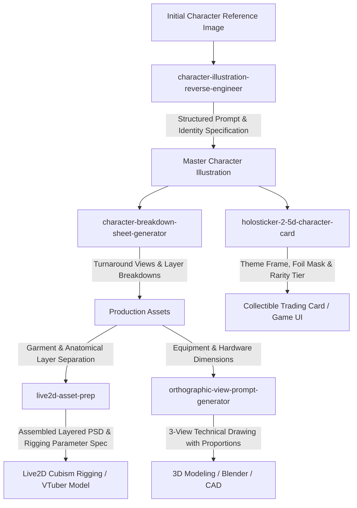

# Full-Stack AI Agent Skills & Creative Asset Specification Suite

[](https://github.com/lingjw02/personal-used-skill-library)
[](https://github.com/lingjw02/personal-used-skill-library)
[](https://github.com/lingjw02/personal-used-skill-library)
[](https://www.python.org/)
[](LICENSE)
[](https://github.com/lingjw02/personal-used-skill-library)

A modular library of 16 specialized **AI Agent Skills** and bundled Python CLI utilities designed for autonomous execution across two domains:

1. **Software Architecture, Autonomous QA & System Evaluation:** Phased roadmap and task specification (`.planning/`), live UI/UX auditing with deterministic WCAG contrast calculations, human-like functional software QA state tracking, empirical agent skill evaluation and regression diffing, three-stage adversarial review, and codebase-grounded documentation generation.
2. **Creative Concept Art & Visual Asset Production:** Multi-angle character model sheets, character illustration prompt reverse-engineering, 2.5D collectible card framing, CAD-dimensioned orthographic three-view prompts, Live2D Cubism layer blueprints with automated PSD assembly, brand logo design systems, and anime wallpaper composition planning.

Compatible with **Google Antigravity (AGY)**, **Claude Code**, **Claude Desktop**, **Cursor**, and major image generation platforms (**Midjourney**, **Flux**, **Stable Diffusion**, **DALL-E 3**).

---

## 📑 Table of Contents

- [🧭 Skills Catalog](#-skills-catalog)
  - [1. Software Architecture, Planning & Engineering](#1-software-architecture-planning--engineering)
  - [2. System Quality Assurance, UI/UX & Evaluation](#2-system-quality-assurance-uiux--evaluation)
  - [3. Frontend, Motion & Documentation Design](#3-frontend-motion--documentation-design)
  - [4. Creative Concept Art & Visual Asset Production](#4-creative-concept-art--visual-asset-production)
- [🔄 Workflows & Production Pipelines](#-workflows--production-pipelines)
  - [Software Engineering & Autonomous QA Pipeline](#a-software-engineering--autonomous-qa-pipeline)
  - [Character & Visual Asset Production Pipeline](#b-character--visual-asset-production-pipeline)
- [🛠️ Bundled Executable Tools & Scripts](#️-bundled-executable-tools--scripts)
- [📊 Skill Performance & Quality Evaluation](#-skill-performance--quality-evaluation)
- [💡 Example Trigger Prompts & Deliverables](#-example-trigger-prompts--deliverables)
- [📂 Repository Structure](#-repository-structure)
- [🚀 Installation & Setup](#-installation--setup)
- [📦 Prepackaged .skill Archives](#-prepackaged-skill-archives)
- [⚖️ Scope, Operating Modes & Limitations](#️-scope-operating-modes--limitations)
- [📄 License](#-license)

---

## 🧭 Skills Catalog

### 1. Software Architecture, Planning & Engineering

| Skill Folder | Description | Bundled Utilities | Primary Deliverables | Target Tools |
|---|---|---|---|---|
| [**`ai-project-architect`**](./ai-project-architect/) | Decomposes project requirements or codebases into dependency-aware, atomic phase blueprints (`.planning/`) for autonomous coding agents. | `init_plan.py`<br/>`validate_plan.py` | Phased roadmap (`ROADMAP.md`), phase task specs (`SPEC.md`, `TASKS.md`), DAG dependency validation, state tracking | Antigravity, Claude Code, Cursor, Codex |

---

### 2. System Quality Assurance, UI/UX & Evaluation

| Skill Folder | Description | Bundled Utilities | Primary Deliverables | Target Tools |
|---|---|---|---|---|
| [**`ui-ux-tester`**](./ui-ux-tester/) | Audits running web applications via mouse, keyboard, and multi-viewport resizing (1920, 1440, 768, 375px) with deterministic contrast checks. | `contrast.py` (WCAG 2.1 ratio calculator) | Severity-ranked UI/UX findings, Design Consistency Matrix, WCAG contrast pass/fail data, component CSS fixes | Playwright, Chrome DevTools, Web Browsers |
| [**`software-qa-tester`**](./software-qa-tester/) | Drives running software applications like a human QA engineer, recording verifiable bug logs, network events, and test session state. | `qa_tracker.py` (state machine & audit logger) | Step-by-step reproduction records, `qa_state.json` session logs, network/console evidence, regression retests | Web Apps, CLI Tools, REST APIs, Desktop Apps |
| [**`skill-performance-evaluator`**](./skill-performance-evaluator/) | Evaluates AI Agent Skills using empirical measurements (trigger precision/recall, paired baseline lift, flakiness, version regression diffs). | 9 evaluation scripts (`validate_structure.py`, `aggregate_runs.py`, etc.) | Quantitative scorecard, baseline comparison report, regression diff, evidence-backed README generator | Agent Skill Developers, CI/CD Skill Evals |
| [**`independent-verification-review`**](./independent-verification-review/) | Three-level adversarial review protocol (Level 1: Facts & Sources, Level 2: Logic & Deductions, Level 3: Unverified Claims & Risks). | Audit checklist templates, epistemic tag guidelines | Structured verification report, source citation validation table, risk triage scorecard | Research, Code Review, Architecture Audits |

---

### 3. Frontend, Motion & Documentation Design

| Skill Folder | Description | Bundled Utilities | Primary Deliverables | Target Tools |
|---|---|---|---|---|
| [**`frontend-motion-icon-design`**](./frontend-motion-icon-design/) | Formulates GPU-accelerated micro-interactions, loading states, and accessible SVG icon tokens adhering to WCAG 2.2 AA target size and contrast rules. | Motion timing & easing reference models | CSS keyframe/transition tokens, SVG icon specifications, `prefers-reduced-motion` fallbacks | CSS, Web Animations, React, Vue, Design Systems |
| [**`logo-identity-designer`**](./logo-identity-designer/) | Guides a complete brand identity workflow: creative intake, 3+ distinct concept directions, evaluation scoring, and vector asset delivery specifications. | Scoring rubrics, color & typography schemas | Logo strategy document, concept scoring matrix, SVG vector tokens, monochrome/color lockups | SVG, Vector Design, Figma, Brand Systems |
| [**`readme-writer`**](./readme-writer/) | Produces structured, accurate Markdown or MDX documentation grounded strictly in existing code manifests and real capabilities. | README structure guidelines, manifest inspection checklist | Markdown/MDX documentation, installation guides, verified usage examples, before/after tables | GitHub GFM, MDX, Open-Source Documentation |

---

### 4. Creative Concept Art & Visual Asset Production

| Skill Folder | Description | Primary Deliverables | Target Tools |
|---|---|---|---|
| [**`anime-wallpaper-prompt-design`**](./anime-wallpaper-prompt-design/) | Generates anime illustration prompts with composition safe-zone planning (16:9, 9:16, 21:9), Danbooru tags, and model parameters. | Structured positive/negative prompts, safe-zone layout map, model sampling parameters | NovelAI, SDXL, FLUX, Midjourney Niji |
| [**`character-breakdown-sheet-generator`**](./character-breakdown-sheet-generator/) | Generates character model turnaround views (front, side, 3/4, back) and garment/accessory layer callouts for 2D/3D artists. | Model turnaround prompts, decomposed layer descriptions, silhouette specifications | Midjourney, SDXL, Flux, 3D Modeling handoff |
| [**`character-illustration-reverse-engineer`**](./character-illustration-reverse-engineer/) | Deconstructs character artwork into a 16-section design specification and structured prompt for character recreation or variation. | 16-section character specification, Critical Identity Checklist, negative prompt constraints | Midjourney v6, SD/Pony, Flux, Concept Art |
| [**`character-reference-sheet`**](./character-reference-sheet/) | Extracts core visual identity into reusable prompt blocks and turnaround specifications to maintain character consistency across outfits and scenes. | Identity-extracted prompt blocks, costume variation rules, feature preservation guide | Midjourney, SD/Pony, Flux, Model Sheets |
| [**`holosticker-2-5d-character-card`**](./holosticker-2-5d-character-card/) | Formats character illustrations into 2.5D collectible card layouts with themed borders, holographic foil masks, and rarity badges (N/R/SR/SSR). | Multi-layer card layout prompt, border framing specs, holographic finish instructions | Photoshop, Stable Diffusion, Game UI |
| [**`image-restoration-skill`**](./image-restoration-skill/) | Diagnoses image defects (blur, noise, compression artifacts, low resolution) and formulates step-by-step restoration workflows and upscaler prompts. | Defect diagnostic analysis, step-by-step restoration workflow, conditioning prompts | SD/Flux, Upscalers, Image Restoration |
| [**`live2d-asset-prep`**](./live2d-asset-prep/) | Generates Live2D Cubism layer hierarchy plans, parameter maps (angles X/Y/Z, eye/mouth forms), and assembles pre-cut PNG parts into a layered PSD. | Layer hierarchy blueprint, rigging parameter map, assembled PSD (via bundled `psd-tools` script) | Live2D Cubism, Photoshop, VTuber Rigging |
| [**`orthographic-view-prompt-generator`**](./orthographic-view-prompt-generator/) | Generates structured image generation prompts for CAD-style orthographic three-view technical drawings (front, side, top views) with dimensions. | Three-view projection prompts, dimension annotation instructions, technical layout specs | Midjourney, CAD, 3D Modeling, Product Design |

---

## 🔄 Workflows & Production Pipelines

### A. Software Engineering & Autonomous QA Pipeline

Chain the architecture, testing, and evaluation skills for end-to-end software development:


### B. Character & Visual Asset Production Pipeline

Chain the creative skills for end-to-end 2D/3D character asset production:



---

## 🛠️ Bundled Executable Tools & Scripts

Several skills in this repository include standalone, deterministic Python CLI utilities (compatible with Python 3.10+, requiring only standard library unless noted):

### 1. Skill Performance Evaluation & Validation (`skill-performance-evaluator`)
- **Validate skill structure and assets:**
  ```bash
  python skill-performance-evaluator/scripts/validate_structure.py <path-to-skill-folder>
  ```
- **Run the evaluation pipeline self-test:**
  ```bash
  python skill-performance-evaluator/tests/run_selftest.py
  ```
- **Calculate trigger metrics (Precision, Recall, F1 with 95% Wilson intervals):**
  ```bash
  python skill-performance-evaluator/scripts/trigger_metrics.py --runs <results/runs> --out <results/trigger-report.json>
  ```
- **Compare two version runs for regressions:**
  ```bash
  python skill-performance-evaluator/scripts/compare_versions.py --a <results-v1> --b <results-v2> --out <regression.json>
  ```

### 2. UI/UX Accessibility Contrast Calculation (`ui-ux-tester`)
- **Calculate WCAG 2.1 relative luminance and contrast ratio between foreground and background colors:**
  ```bash
  python ui-ux-tester/scripts/contrast.py "#1e293b" "#f8fafc"
  # Output: Contrast ratio: 14.86:1 (Passes WCAG AA and AAA for all text sizes)
  ```

### 3. QA Session State Tracking (`software-qa-tester`)
- **Initialize a structured QA test session:**
  ```bash
  python software-qa-tester/scripts/qa_tracker.py init --scope "User Authentication & Password Reset"
  ```
- **Log an executed action, result, and bug record:**
  ```bash
  python software-qa-tester/scripts/qa_tracker.py log-step "Submit empty login form" --status pass --evidence "inline-validation-rendered.png"
  ```

### 4. Implementation Plan Validation (`ai-project-architect`)
- **Validate DAG dependencies, phase sequences, and task structures in `.planning/`:**
  ```bash
  python ai-project-architect/scripts/validate_plan.py --plan-dir .planning
  ```

---

## 📊 Skill Performance & Quality Evaluation

All skills in this library are governed by the empirical testing principles established in [`skill-performance-evaluator`](./skill-performance-evaluator/):

```
INSPECT -> UNDERSTAND INTENT -> DESIGN TESTS -> VALIDATE STRUCTURE -> TEST TRIGGERING -> RUN BASELINE -> RUN WITH SKILL -> COMPARE -> REPEAT -> ANALYZE FAILURES -> CHECK REGRESSION -> REPORT -> README
```

### Evaluation Disciplines
- **Evidence Labeling:** Statements in evaluation reports are strictly labeled as `FACT` (directly observed), `MEASURED RESULT` (computed from run records with confidence intervals), `INFERENCE` (reasoned conclusions from data), `RECOMMENDATION` (actionable modifications citing evidence), or `UNCERTAINTY` (untested areas or harness limits).
- **Execution Modes:** Distinguishes between **static** inspection (file analysis), **simulated** execution (unisolated or role-played context), and **actual** execution (real tasks run with real tools in clean environments). Only `actual` runs contribute to performance metrics.
- **Zero Fabricated Claims:** No evaluative superlatives (e.g. "superior", "flawless", "guaranteed") are used without cited empirical data. Missing measurements are explicitly recorded as `Not measured`.

---

## 💡 Example Trigger Prompts & Deliverables

Below are sample prompts that trigger each skill and the resulting outputs:

| Skill | Example Prompt | Expected Deliverable |
|---|---|---|
| `ai-project-architect` | *"Decompose this project specification into a phased roadmap with atomic task specifications in `.planning/`."* | Complete `.planning/` directory with `ROADMAP.md`, `STATE.md`, and phase `SPEC.md` / `TASKS.md` files. |
| `ui-ux-tester` | *"Audit the user interface of our running dashboard across desktop and mobile viewports."* | UI/UX audit report, Design Consistency Matrix, WCAG contrast calculations, and targeted CSS/component remedies. |
| `software-qa-tester` | *"Smoke-test the checkout flow of this web application and log any bugs encountered."* | Step-by-step reproduction steps, `qa_state.json` execution tracker log, and developer fix recommendations. |
| `skill-performance-evaluator` | *"Benchmark this skill folder against a no-skill baseline across 10 evaluation tasks."* | Quantitative scorecard (`evaluations.json`, `performance.json`), baseline lift deltas, and failure breakdown. |
| `independent-verification-review` | *"Perform a three-level verification review on this technical report before publication."* | Three-level audit report: verified facts with sources, logical consistency check, and highlighted unconfirmed risks. |
| `frontend-motion-icon-design` | *"Design CSS micro-interaction transitions and an accessible SVG icon system for our navigation bar."* | GPU-accelerated CSS tokens, WCAG AA compliant SVG icon assets, and `prefers-reduced-motion` fallbacks. |
| `logo-identity-designer` | *"Design a brand identity and logo system for a developer analytics platform named TraceFlow."* | Creative brief, 3 distinct conceptual directions with scoring, SVG vector lockups, and color palette tokens. |
| `readme-writer` | *"Write a comprehensive README for this repository based strictly on the existing code and manifests."* | Structured Markdown README with verified setup commands, runnable examples, and accurate directory mapping. |
| `anime-wallpaper-prompt-design` | *"Create a 16:9 desktop anime wallpaper prompt of a mage in a floating library at sunset."* | Tuned prompt with Danbooru tags, safe-zone composition framing (center/taskbar), and model parameters. |
| `character-breakdown-sheet-generator` | *"Generate a multi-view model sheet and garment layer breakdown for this cyberpunk character."* | Four-angle turnaround prompt (front, side, 3/4, back) and segmented garment/accessory callout specs. |
| `character-illustration-reverse-engineer` | *"Analyze this character image and generate a structured prompt that reproduces her visual identity."* | 16-section character specification, Critical Identity Checklist, and targeted negative prompt tokens. |
| `character-reference-sheet` | *"Extract a reusable character reference sheet from this illustration for multi-scene generation."* | Core identity prompt blocks, hairstyle/outfit turnaround rules, and feature preservation instructions. |
| `holosticker-2-5d-character-card` | *"Convert this character portrait into an SSR-rarity holographic collectible card design."* | 2.5D layered composition prompt, themed border framing, foil mask specifications, and rarity badge placement. |
| `image-restoration-skill` | *"Analyze this compressed, low-resolution anime screenshot and provide an upscale restoration plan."* | Defect diagnosis, model selection, multi-pass upscaler workflow, and ControlNet conditioning parameters. |
| `live2d-asset-prep` | *"Prepare this character illustration for Live2D Cubism rigging with a layer separation plan."* | Layer hierarchy blueprint, rigging parameter map (angles X/Y/Z, expressions), and assembled PSD specification. |
| `orthographic-view-prompt-generator` | *"Generate an orthographic three-view technical drawing prompt for a robotic drone."* | Structured prompt specifying front, side, and top views aligned on a clean white background with dimension lines. |

---

## 📂 Repository Structure

```
Skills/
├── ai-project-architect/                 # Phase planning, task decomposition & .planning/ blueprint
│   ├── SKILL.md                          # Skill specification
│   ├── README.md                         # Architecture methodology & guides
│   ├── scripts/                          # init_plan.py, validate_plan.py
│   ├── references/                       # Architecture, phases, requirements, quality gates
│   └── assets/templates/                 # Markdown templates for .planning/ artifacts
│
├── anime-wallpaper-prompt-design/        # Anime wallpaper & safe-zone prompt engineering
│   ├── SKILL.md                          # Skill specification
│   ├── README.md                         # Aspect ratio & composition guidelines
│   └── references/                       # Danbooru tags, model parameters & resolution tables
│
├── character-breakdown-sheet-generator/  # Turnaround views, model sheets & layer callouts
│   ├── SKILL.md                          # Skill specification
│   ├── README.md                         # Turnaround projection & layer separation guide
│   └── references/                       # Pose consistency & prompt templates
│
├── character-illustration-reverse-engineer/ # 16-section art deconstruction & prompt synthesis
│   ├── SKILL.md                          # Skill specification
│   ├── README.md                         # Decompilation guide & identity checklist
│   └── references/                       # Attribute extraction tables & prompt syntax
│
├── character-reference-sheet/            # Reusable character turnarounds & visual identity lock
│   ├── SKILL.md                          # Skill specification
│   ├── README.md                         # Reference sheet methodology
│   └── references/                       # Consistency controls & costume transfer guides
│
├── frontend-motion-icon-design/          # UI/UX micro-interactions, CSS motion & accessible icons
│   ├── SKILL.md                          # Skill specification
│   ├── README.md                         # Motion physics & icon design rules
│   └── references/                       # Easing curves, WCAG 2.2 AA checklists & SVG guidelines
│
├── holosticker-2-5d-character-card/      # 2.5D collectible card frames & foil effects
│   ├── SKILL.md                          # Skill specification
│   ├── README.md                         # Card architecture & rarity tier guides
│   └── references/                       # Border framing, layer depths & foil textures
│
├── image-restoration-skill/              # Upscaling, deblurring & defect restoration
│   ├── SKILL.md                          # Skill specification
│   ├── README.md                         # Restoration workflows & model pipelines
│   └── references/                       # Defect taxonomy, upscaler comparisons & prompts
│
├── independent-verification-review/      # 3-level factual, logical & risk verification protocol
│   ├── SKILL.md                          # Skill specification
│   ├── README.md                         # Verification methodology & level checklist
│   └── references/                       # Epistemic tags, evidence standards & error modes
│
├── live2d-asset-prep/                    # Layer hierarchy blueprints & automated PSD assembly
│   ├── SKILL.md                          # Skill specification
│   ├── README.md                         # Rigging blueprint & QA guide
│   ├── requirements.txt                  # Python dependencies (Pillow, psd-tools)
│   ├── scripts/                          # Automated PSD assembly script
│   └── references/                       # Layer hierarchies, parameters & checklists
│
├── logo-identity-designer/               # Multi-concept brand identity & vector delivery specs
│   ├── SKILL.md                          # Skill specification
│   ├── README.md                         # Brand identity guide & evaluation rubrics
│   └── references/                       # Creative directions, SVG specifications & palettes
│
├── orthographic-view-prompt-generator/   # CAD-dimensioned multi-view orthographic prompts
│   ├── SKILL.md                          # Skill specification
│   ├── README.md                         # CAD projection rules & dimensioning guidelines
│   └── references/                       # View alignment, background isolation & prompts
│
├── readme-writer/                        # Accurate documentation & Markdown README engineering
│   ├── SKILL.md                          # Skill specification
│   └── README.md                         # Documentation rules & Before/After comparisons
│
├── skill-performance-evaluator/          # Empirical testing, trigger metrics & regression diffs
│   ├── SKILL.md                          # Skill specification
│   ├── README.md                         # Evaluation framework guide
│   ├── scripts/                          # 9 evaluation scripts (validation, metrics, reports)
│   ├── references/                       # Metrics, test design, failure modes, schemas
│   ├── assets/templates/                 # JSON templates for evals, narratives & runs
│   └── tests/                            # run_selftest.py pipeline verification
│
├── software-qa-tester/                   # Human-like QA testing, live bug filing & retesting
│   ├── SKILL.md                          # Skill specification
│   ├── README.md                         # QA execution protocol
│   ├── scripts/                          # qa_tracker.py state machine
│   ├── references/                       # Discovery, evidence, bugs, safety & retest guides
│   └── examples/sample-run/              # Sample QA run artifacts & logs
│
├── ui-ux-tester/                         # Autonomous UI/UX auditing, viewport resizing & a11y
│   ├── SKILL.md                          # Skill specification
│   ├── README.md                         # UI/UX testing methodology
│   ├── scripts/                          # contrast.py (WCAG luminance & contrast ratio)
│   └── references/                       # Checklists, measurement snippets, report template
│
├── packages/                             # Standalone .skill zip packages for all 16 skills
│   ├── all-skills.zip                    # Consolidated bundle of all skills
│   ├── ai-project-architect.skill
│   ├── anime-wallpaper-prompt-design.skill
│   ├── character-breakdown-sheet-generator.skill
│   ├── character-illustration-reverse-engineer.skill
│   ├── character-reference-sheet.skill
│   ├── frontend-motion-icon-design.skill
│   ├── holosticker-2-5d-character-card.skill
│   ├── image-restoration-skill.skill
│   ├── independent-verification-review.skill
│   ├── live2d-asset-prep.skill
│   ├── logo-identity-designer.skill
│   ├── orthographic-view-prompt-generator.skill
│   ├── readme-writer.skill
│   ├── skill-performance-evaluator.skill
│   ├── software-qa-tester.skill
│   └── ui-ux-tester.skill
│
├── .gitignore
├── LICENSE
└── README.md
```

---

## 🚀 Installation & Setup

### Option 1: Google Antigravity (AGY)
To install skills in Antigravity:
1. **Workspace level** (recommended for project-specific use):
   ```bash
   mkdir -p .agent/skills
   cp -r <skill-folder> .agent/skills/
   ```
2. **Global level** (available across all projects):
   ```bash
   cp -r <skill-folder> ~/.gemini/antigravity-cli/builtin/skills/
   ```
3. The skill is automatically indexed and discovered during conversation.

### Option 2: Claude Code / Claude Desktop / Cursor
1. Clone this repository or copy individual skill folders to your `.claude/skills` directory:
   ```bash
   mkdir -p ~/.claude/skills
   cp -r <skill-folder> ~/.claude/skills/
   ```
2. Trigger the skill naturally in conversation (see [Example Trigger Prompts](#-example-trigger-prompts--deliverables)).

### Option 3: Prepackaged `.skill` Archives
If your environment accepts `.skill` zip uploads directly, download the prepackaged archives from [`packages/`](./packages/):

- 🏗️ [`ai-project-architect.skill`](./packages/ai-project-architect.skill)
- 🎯 [`ui-ux-tester.skill`](./packages/ui-ux-tester.skill)
- 🧪 [`software-qa-tester.skill`](./packages/software-qa-tester.skill)
- 📊 [`skill-performance-evaluator.skill`](./packages/skill-performance-evaluator.skill)
- 🛡️ [`independent-verification-review.skill`](./packages/independent-verification-review.skill)
- ⚡ [`frontend-motion-icon-design.skill`](./packages/frontend-motion-icon-design.skill)
- 📝 [`readme-writer.skill`](./packages/readme-writer.skill)
- 🎨 [`anime-wallpaper-prompt-design.skill`](./packages/anime-wallpaper-prompt-design.skill)
- 📐 [`character-breakdown-sheet-generator.skill`](./packages/character-breakdown-sheet-generator.skill)
- 🔍 [`character-illustration-reverse-engineer.skill`](./packages/character-illustration-reverse-engineer.skill)
- 📋 [`character-reference-sheet.skill`](./packages/character-reference-sheet.skill)
- 🎴 [`holosticker-2-5d-character-card.skill`](./packages/holosticker-2-5d-character-card.skill)
- 🛠️ [`image-restoration-skill.skill`](./packages/image-restoration-skill.skill)
- 🎭 [`live2d-asset-prep.skill`](./packages/live2d-asset-prep.skill)
- 🏷️ [`logo-identity-designer.skill`](./packages/logo-identity-designer.skill)
- 📐 [`orthographic-view-prompt-generator.skill`](./packages/orthographic-view-prompt-generator.skill)
- 📦 [`all-skills.zip`](./packages/all-skills.zip) (all 16 skills bundled)

---

## ⚖️ Scope, Operating Modes & Limitations

In accordance with empirical evaluation principles:

1. **Deterministic vs Heuristic Components:**
   - **Deterministic:** Bundled Python CLI utilities (`validate_structure.py`, `contrast.py`, `qa_tracker.py`, `validate_plan.py`) produce exact, verifiable outputs based on explicit algorithms and standards (WCAG 2.1 math, JSON schemas, AST parsing).
   - **Heuristic:** Prompt engineering and creative asset skills generate structured instructions for downstream models. Output quality depends on the target model's training, prompt adherence, and seed variation.
2. **Environment Tool Requirements:**
   - Live testing skills (`software-qa-tester`, `ui-ux-tester`) require host environment execution capabilities (e.g. Chrome DevTools, Playwright, bash/terminal, or subagents) to interact with running software. In single-context environments lacking browser or execution tools, tests cannot execute live and must be classified as `simulated` or `static`.
3. **Statistical Sample Caveats:**
   - Single runs do not demonstrate reliability. When evaluating skills, perform repeated runs (3+ default) and evaluate metrics with confidence intervals as defined in `skill-performance-evaluator`.

---

## 📄 License

This repository is licensed under the [MIT License](LICENSE).
