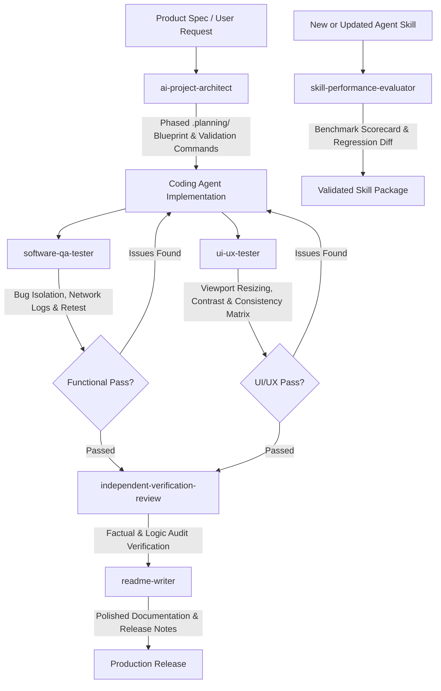
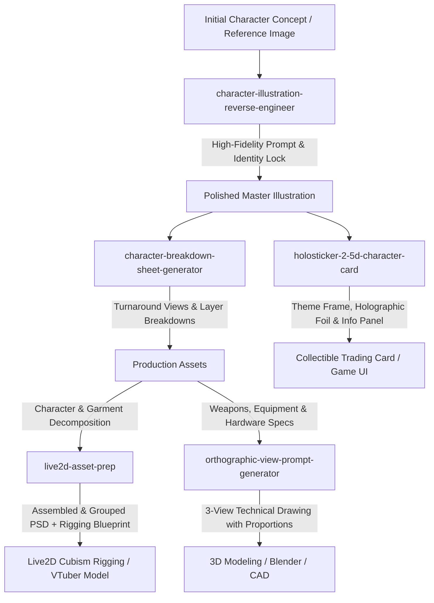

# ⚡ Full-Stack AI Agent Skills & Creative Production Suite

[](https://github.com/lingjw02/personal-used-skill-library)
[](https://github.com/lingjw02/personal-used-skill-library)
[](https://github.com/lingjw02/personal-used-skill-library)
[](https://github.com/lingjw02/personal-used-skill-library)
[](LICENSE)

A curated suite of specialized **AI Agent Skills** designed for autonomous execution across two core domains:

1. **Software Architecture, Engineering & Autonomous QA:** Dependency-aware phase planning (`.planning/`), live functional system testing, interactive UI/UX and accessibility auditing, empirical agent skill benchmarking, three-level factual verification, and senior motion & documentation design.
2. **Creative Concept Art & Visual Asset Production:** High-fidelity character decompilation, 2.5D collectible cards, CAD-precision orthographic 3-view blueprints, Live2D Cubism rigging preparation, brand logo identity, and anime wallpaper prompt synthesis.

Fully compatible with **Google Antigravity (AGY)**, **Claude Code**, **Claude Desktop**, **Cursor**, **Gemini CLI**, and leading generative models (**Midjourney**, **Flux**, **Stable Diffusion**, **DALL-E 3**).

---

## 📑 Quick Navigation

- [🧭 Skills Catalog](#-skills-catalog)
  - [1. Software Architecture, Planning & Engineering](#1-software-architecture-planning--engineering)
  - [2. System Quality Assurance, UI/UX & Evaluation](#2-system-quality-assurance-uiux--evaluation)
  - [3. Frontend, Motion & Documentation Design](#3-frontend-motion--documentation-design)
  - [4. Creative Concept Art & Character Production](#4-creative-concept-art--character-production)
- [🔄 Workflows & Production Pipelines](#-workflows--production-pipelines)
  - [Software Engineering & Autonomous QA Pipeline](#a-software-engineering--autonomous-qa-pipeline)
  - [Character & Visual Production Pipeline](#b-character--visual-production-pipeline)
- [📂 Repository Structure](#-repository-structure)
- [🚀 Installation & Usage](#-installation--usage)
- [📦 Prepackaged .skill Archives](#option-3-prepackaged-skill-archives)
- [📄 License](#-license)

---

## 🧭 Skills Catalog

### 1. Software Architecture, Planning & Engineering

| Skill Folder | Description | Primary Deliverables | Target Tools & Workflows |
|---|---|---|---|
| [**`ai-project-architect`**](./ai-project-architect/) | Decomposes complex specs or codebases into dependency-aware, atomic phase blueprints (`.planning/`) that coding agents can execute autonomously. | Phased roadmap + atomic task specs + DAG dependency graph + automated validation commands | Antigravity, Claude Code, Cursor, Codex, Full-Stack Architecture |

---

### 2. System Quality Assurance, UI/UX & Evaluation

| Skill Folder | Description | Primary Deliverables | Target Tools & Workflows |
|---|---|---|---|
| [**`ui-ux-tester`**](./ui-ux-tester/) | Autonomous UI/UX auditing of running interfaces via keyboard, mouse, and viewport resizing (1920/1440/768/375px) with WCAG contrast calculations. | Evidence-based UI/UX audit report + Design Consistency Matrix + concrete CSS/component fixes | Web Apps, Dashboards, Playwright, Chrome DevTools, Usability QA |
| [**`software-qa-tester`**](./software-qa-tester/) | Operates and tests running applications like a human QA engineer with real clicks, inputs, network logs, and immutable audit state tracking. | Verifiable bug reproduction records + state tracker logs + developer fix recommendations | Web Apps, CLI, APIs, Desktop Apps, Regression Retesting |
| [**`skill-performance-evaluator`**](./skill-performance-evaluator/) | Benchmarks and evaluates AI Agent Skills with empirical evidence (trigger precision/recall, baseline lift, flakiness, version regression diffs). | Quantitative scorecard + baseline comparison report + automated regression metrics | Agent Skill Developers, Evals, CI/CD Skill Benchmarks |
| [**`independent-verification-review`**](./independent-verification-review/) | Three-level adversarial audit protocol (Facts & Sources → Logic & Deductions → Risk & Adversarial Assessment) eliminating AI hallucinations. | Multi-tier review checklist + factual verification report + epistemic confidence scores | Research, Content Review, Critical Architecture Auditing |

---

### 3. Frontend, Motion & Documentation Design

| Skill Folder | Description | Primary Deliverables | Target Tools & Workflows |
|---|---|---|---|
| [**`frontend-motion-icon-design`**](./frontend-motion-icon-design/) | Senior UI/UX motion design, micro-interactions, loading states, and accessible icon systems (WCAG 2.2 AA). | GPU-accelerated motion guidelines + accessible SVG icon tokens + framework code | Web, React, Vue, CSS, Lottie, Design Systems |
| [**`logo-identity-designer`**](./logo-identity-designer/) | Complete brand identity workflow (intake, creative strategy, 3+ concepts, scoring, vector production delivery). | Logo strategy + evaluation scoring + lockups & brand vector delivery specs | Illustrator, SVG, Vector Design, Brand Systems, UI/UX |
| [**`readme-writer`**](./readme-writer/) | Generates high-accuracy, beautifully structured README and documentation pages tailored to real project codebases. | Clean Markdown/MDX documentation + installation guides + usage examples | GitHub, Markdown, Documentation, Open Source Projects |

---

### 4. Creative Concept Art & Character Production

| Skill Folder | Description | Primary Deliverables | Target Tools & Workflows |
|---|---|---|---|
| [**`anime-wallpaper-prompt-design`**](./anime-wallpaper-prompt-design/) | Anime character wallpaper & illustration prompt engineering (NovelAI, SDXL, FLUX, Midjourney Niji) with safe zones. | Tuned prompt + Danbooru tags + parameters + safe-zone composition plan | NovelAI, SDXL/ComfyUI, Flux, Midjourney Niji, Wallpapers |
| [**`character-breakdown-sheet-generator`**](./character-breakdown-sheet-generator/) | Generates character model sheets, turnaround views (front/side/back), and decomposed layer callouts. | Structured prompt + layout plan + consistency controls | Midjourney, SDXL, Flux, 3D Modeler handoff |
| [**`character-illustration-reverse-engineer`**](./character-illustration-reverse-engineer/) | Deconstructs character artwork into design specs and high-fidelity generation prompts preserving character DNA. | 16-section generation prompt + Critical Identity List | Midjourney v6, SD/Pony, Flux, Concept Art |
| [**`character-reference-sheet`**](./character-reference-sheet/) | Generates clean, reusable character reference sheets from source art to maintain visual consistency for fan art & outfits. | Identity-extracted prompt + silhouette & turnaround guide | Midjourney, SD/Pony, Flux, Concept Art, Model Sheets |
| [**`holosticker-2-5d-character-card`**](./holosticker-2-5d-character-card/) | Transforms character art into luxury 2.5D collectible cards (HoloSticker) with theme-aware frames & foil effects. | 2.5D layered design + theme frame + rarity tier (N/R/SR/SSR) | Photoshop, Stable Diffusion, Game UI, Collectibles |
| [**`image-restoration-skill`**](./image-restoration-skill/) | Restores, denoises, deblurs, removes artifacts, and upscales damaged/low-resolution images into HD. | Restoration prompt + defect analysis + HD reconstruction | SD/Flux, Upscalers, Photo & Anime Restoration |
| [**`live2d-asset-prep`**](./live2d-asset-prep/) | Prepares character art for Live2D Cubism rigging: generates layer hierarchies, parameter maps, and assembles PSDs. | Layer blueprint + rigging spec + assembled PSD & QA report | Live2D Cubism, VTubers, Photoshop, Spine |
| [**`orthographic-view-prompt-generator`**](./orthographic-view-prompt-generator/) | Generates mathematically consistent prompts for CAD-style 3D three-view drawings (front/side/top/isometric). | True orthographic multi-view prompt with dimensions | Midjourney, CAD, 3D Modeling, Product Design |

---

## 🔄 Workflows & Production Pipelines

### A. Software Engineering & Autonomous QA Pipeline

Chain the architecture, testing, and evaluation skills for end-to-end software development:



### B. Character & Visual Production Pipeline

Chain the creative skills for complete 2D/3D character asset production:



---

## 📂 Repository Structure

```
Skills/
├── ai-project-architect/                 # Phase planning, task decomposition & .planning/ blueprint
│   ├── SKILL.md                          # Skill specification
│   ├── README.md                         # Architecture methodology & guides
│   ├── scripts/                          # init_plan.py, validate_plan.py
│   └── references/                       # Architecture, phases, requirements, quality gates
│
├── anime-wallpaper-prompt-design/        # High-res anime wallpaper & safe-zone prompt engineering
├── character-breakdown-sheet-generator/  # Turnaround views, model sheets & layer callouts
├── character-illustration-reverse-engineer/ # 16-section art deconstruction & prompt synthesis
├── character-reference-sheet/            # Reusable character turnarounds & visual identity lock
├── frontend-motion-icon-design/          # UI/UX micro-interactions, CSS motion & accessible icons
├── holosticker-2-5d-character-card/      # 2.5D collectible card frames & foil effects
├── image-restoration-skill/              # Upscaling, deblurring & defect restoration
├── independent-verification-review/      # 3-level factual, logical & risk verification protocol
├── live2d-asset-prep/                    # Layer hierarchy blueprints & automated PSD assembly
├── logo-identity-designer/               # Multi-concept brand identity & vector delivery specs
├── orthographic-view-prompt-generator/   # CAD-dimensioned multi-view orthographic prompts
├── readme-writer/                        # Accurate documentation & Markdown README engineering
│
├── skill-performance-evaluator/          # Empirical testing, trigger metrics & regression diffs
│   ├── SKILL.md                          # Skill specification
│   ├── README.md                         # Evaluation framework guide
│   ├── scripts/                          # validate_structure.py, trigger_metrics.py, compare_versions.py
│   └── references/                       # Metrics, test design, failure modes, regression schemas
│
├── software-qa-tester/                   # Human-like QA testing, live bug filing & retesting
│   ├── SKILL.md                          # Skill specification
│   ├── README.md                         # QA execution protocol
│   ├── scripts/                          # qa_tracker.py state machine
│   └── references/                       # Discovery, evidence, bugs, safety & retest guides
│
├── ui-ux-tester/                         # Autonomous UI/UX auditing, viewport resizing & a11y
│   ├── SKILL.md                          # Skill specification
│   ├── README.md                         # UI/UX testing methodology
│   ├── scripts/                          # contrast.py (WCAG luminance & contrast ratio)
│   └── references/                       # Checklists, measurement snippets, report template
│
├── packages/                             # Standalone .skill zip packages for all 16 skills
│   ├── all-skills.zip                    # Consolidated bundle of all skills
│   ├── ai-project-architect.skill
│   ├── anime-wallpaper-prompt-design.skill
│   ├── character-breakdown-sheet-generator.skill
│   ├── character-illustration-reverse-engineer.skill
│   ├── character-reference-sheet.skill
│   ├── frontend-motion-icon-design.skill
│   ├── holosticker-2-5d-character-card.skill
│   ├── image-restoration-skill.skill
│   ├── independent-verification-review.skill
│   ├── live2d-asset-prep.skill
│   ├── logo-identity-designer.skill
│   ├── orthographic-view-prompt-generator.skill
│   ├── readme-writer.skill
│   ├── skill-performance-evaluator.skill
│   ├── software-qa-tester.skill
│   └── ui-ux-tester.skill
│
├── .gitignore
├── LICENSE
└── README.md
```

---

## 🚀 Installation & Usage

### Option 1: Using with Google Antigravity (AGY)
To use any skill in your Antigravity workflows:
1. Copy the desired skill folder (e.g. `ui-ux-tester/` or `ai-project-architect/`) to your project's skills directory:
   ```bash
   # Workspace-level skills
   mkdir -p .agent/skills
   cp -r ui-ux-tester .agent/skills/
   ```
   Or install globally for all projects:
   ```bash
   # Global skills
   cp -r ui-ux-tester ~/.gemini/antigravity-cli/builtin/skills/
   ```
2. The skill is automatically indexed and discovered by the agent during conversation.

### Option 2: Using with Claude Code / Claude Desktop / Cursor
1. Clone this repository or copy individual skill folders to your `.claude/skills` directory:
   ```bash
   mkdir -p ~/.claude/skills
   cp -r software-qa-tester ~/.claude/skills/
   cp -r ui-ux-tester ~/.claude/skills/
   ```
2. In chat, activate naturally by prompting the agent (e.g. *"Audit our dashboard UI at 375px viewport"* or *"Plan out this feature in .planning/"*).

### Option 3: Prepackaged `.skill` Archives
If your agent environment accepts `.skill` package uploads directly, download the ready-to-use zip packages from the [`packages/`](./packages/) directory:

- 🏗️ [`ai-project-architect.skill`](./packages/ai-project-architect.skill)
- 🎯 [`ui-ux-tester.skill`](./packages/ui-ux-tester.skill)
- 🧪 [`software-qa-tester.skill`](./packages/software-qa-tester.skill)
- 📊 [`skill-performance-evaluator.skill`](./packages/skill-performance-evaluator.skill)
- 🛡️ [`independent-verification-review.skill`](./packages/independent-verification-review.skill)
- ⚡ [`frontend-motion-icon-design.skill`](./packages/frontend-motion-icon-design.skill)
- 📝 [`readme-writer.skill`](./packages/readme-writer.skill)
- 🎨 [`anime-wallpaper-prompt-design.skill`](./packages/anime-wallpaper-prompt-design.skill)
- 📐 [`character-breakdown-sheet-generator.skill`](./packages/character-breakdown-sheet-generator.skill)
- 🔍 [`character-illustration-reverse-engineer.skill`](./packages/character-illustration-reverse-engineer.skill)
- 📋 [`character-reference-sheet.skill`](./packages/character-reference-sheet.skill)
- 🎴 [`holosticker-2-5d-character-card.skill`](./packages/holosticker-2-5d-character-card.skill)
- 🛠️ [`image-restoration-skill.skill`](./packages/image-restoration-skill.skill)
- 🎭 [`live2d-asset-prep.skill`](./packages/live2d-asset-prep.skill)
- 🏷️ [`logo-identity-designer.skill`](./packages/logo-identity-designer.skill)
- 📐 [`orthographic-view-prompt-generator.skill`](./packages/orthographic-view-prompt-generator.skill)

### Option 4: Standalone / Manual Prompting
All skills contain ready-to-copy prompt structures and reference guides in their respective folders that can be utilized directly in:
- **Claude / Antigravity / Cursor / ChatGPT**
- **Midjourney** (v6+ recommended)
- **Flux.1** (Dev / Schnell)
- **Stable Diffusion WebUI / ComfyUI**
- **DALL-E 3**

---

## 📄 License

This project is licensed under the **MIT License** - see the [LICENSE](LICENSE) file for details.
