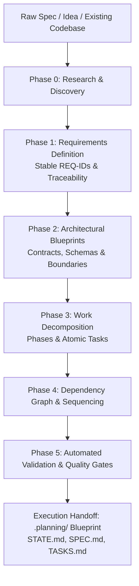

# 🏗️ AI Project Architect & Phase Planner

[](https://github.com/lingjw02/personal-used-skill-library)
[](https://github.com/lingjw02/personal-used-skill-library)
[](SKILL.md)
[](../LICENSE)
[](SKILL.md)

Turn a software idea, product requirement, rough specification, or existing codebase into an autonomous, dependency-aware, phase-by-phase implementation blueprint (the `.planning/` directory) that another AI coding agent (Antigravity, Claude Code, Cursor, Codex, Gemini CLI) can execute without stalling.

This is a **pure planning & architecture skill** — it does not write application code. It establishes verifiable requirement IDs, architecture sketches, dependency graphs, phased roadmaps, atomic tasks with concrete validation commands, risk registers, and handoff contracts.

---

## ⚖️ Before & After Comparison

| Factor | ❌ Standard LLM Planning (Ad-hoc Task Checklist) | ✅ Autonomous `ai-project-architect` Blueprint |
|---|---|---|
| **Execution Continuity** | Generates a 20-bullet generic checklist; agent stalls halfway due to missing dependencies | Strict dependency DAG with explicit prerequisite contracts and atomic execution phases |
| **Fact Verification** | Silently hallucinates directory layouts, library versions, and API capabilities | Uses strict **Evidence Labels** (`VERIFIED`, `UNKNOWN`, `ASSUMPTION`, `REQUIRES USER DECISION`) |
| **Task Atomicity** | Bloated tasks ("Build authentication and database"); executor loses context and times out | Single-context tasks (15–30 min execution bounds) each equipped with automated verification commands |
| **Codebase Alignment** | Rewrites architecture from scratch without inspecting existing patterns | Inspects existing repo conventions, manifests, types, and schemas before designing phases |
| **State Tracking** | No persistent tracking; subsequent agent runs lose context of progress | Generates `.planning/STATE.md` and phase manifests with real-time status and handoff contracts |

---

## 🔄 Architectural Planning Pipeline



---

## 📂 Repository Structure

```
ai-project-architect/
├── SKILL.md                                  # Core architectural planning protocol
├── README.md                                 # Documentation & phase-planning methodology
├── scripts/
│   ├── init_plan.py                          # Initializes standardized .planning/ directory tree
│   └── validate_plan.py                      # Validates DAG integrity, task IDs & prerequisite links
├── references/
│   ├── architecture.md                       # Architectural sketching & boundary definitions
│   ├── discovery.md                          # Repository inspection & orientation probes
│   ├── execution-handoff.md                  # Handoff contracts for autonomous AI executors
│   ├── phases-and-tasks.md                   # Sizing, atomicity, and phase structure guides
│   ├── quality-gates.md                      # Verification gates and validation command standards
│   ├── requirements.md                       # Stable REQ-ID formats & traceability matrices
│   └── risk-decisions-unknowns.md            # Risk register, ADR templates & unknowns tracking
└── examples/
    └── sample-plan/                          # Worked full .planning/ blueprint example
```

---

## 🚀 Installation & Setup

### For Google Antigravity (AGY)
```bash
# Workspace level
mkdir -p .agent/skills
cp -r ai-project-architect .agent/skills/

# Global level
cp -r ai-project-architect ~/.gemini/antigravity-cli/builtin/skills/
```

### For Claude Code / Claude Desktop / Cursor
```bash
mkdir -p ~/.claude/skills
cp -r ai-project-architect ~/.claude/skills/
```

---

## 💡 Example Trigger Prompts

- *"Break down this multi-tenant SaaS idea into a phase-by-phase `.planning/` implementation blueprint."*
- *"Architect a migration from REST to GraphQL for this codebase before we begin coding."*
- *"Audit our existing PRD and generate atomic, dependency-sequenced tasks with automated validation checks."*
- *"Create a phased roadmap and handoff contract for another AI agent to implement user authentication."*

---

## 📄 License

This skill is distributed under the [MIT License](../LICENSE).
