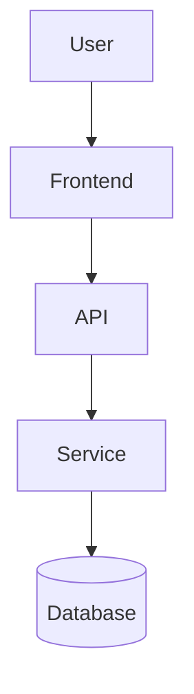

# Architecture — {{PROJECT_NAME}}

## 1. System Overview
{{Two or three sentences + the key architectural style.}}


{{Replace with the real diagram; show trust boundaries and external systems.}}

## 2. Components
### CMP-01 — {{Name}}   Status: {{EXISTS(extend) | NEW | MODIFY}}
- Responsibility: {{…}}
- Inputs: {{…}}   Outputs: {{…}}
- Depends on: {{CMP-…}}
- Interfaces: {{API-…, EVT-…}}
- Data ownership: {{…}}
- Failure behavior: {{…}}
- Security: {{…}}
- Existing code: {{path (VERIFIED) | none}}

## 3. Data Models
### ENT-1 — {{Entity}}
{{fields, types, constraints, relationships, migration notes}}

## 4. Interfaces
### API-1 — {{METHOD /path}}
{{auth, request schema, response schema, errors, idempotency}}

| Interface | Producer | Consumer(s) | What consumers need | Contract owner |
|---|---|---|---|---|
| API-1 | CMP-{{…}} | CMP-{{…}} | {{…}} | {{…}} |

## 5. Change Strategy for Existing Code
| Area (path) | Choice (extend/refactor/replace/new) | Justification | DEC |
|---|---|---|---|

## 6. Dependency Graph
```text
{{Task/phase dependency graph; mark critical path and parallel branches.}}
```

## 7. Cross-Cutting
Configuration/secrets: {{…}}  Observability: {{…}}  Testing layers: {{…}}  Deployment: {{…}}
