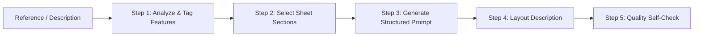

# Character Breakdown Sheet Generator

> **AI Skill**: Generate production-ready character design breakdown sheets, turnaround views (front/side/back), and decomposed model sheets with strict consistency controls.

---

## 📌 Overview

**Character Breakdown Sheet Generator** transforms a character—from a reference image, concept art, or text description—into a **structured, ready-to-use prompt** for creating professional character breakdown sheets (角色拆分图 / 设定集).

The output is engineered to give 2D artists, 3D modelers, animators, or AI image generation tools (Midjourney, Stable Diffusion, Flux, DALL-E 3) an unambiguous, consistent blueprint of a character from multiple angles with isolated clothing layers and equipment details.

### Why This Skill Exists
The number one failure mode in multi-view character generation is **character drift**:
- Hair that shrinks or changes parting between front and back views
- Jacket colors or lining shifting across panels
- Randomly disappearing or newly appearing accessories
- Proportions or face geometry shifting from panel to panel

This skill treats the character as **one fixed 3D identity**, locking key visual markers across every view and callout.

---

## ⚖️ Before & After Comparison

| Factor | ❌ Before (Ad-Hoc Model Sheet Prompting) | ✅ After (With `character-breakdown-sheet-generator`) |
|---|---|---|
| **Multi-View Consistency** | Severe character drift: hair length, eye color, and costume details morph between front, side, and back views | Unified 3D identity lock: establishes rigid anchor points across all 3 views maintaining exact proportions |
| **Layer Decomposition** | Flat illustration only; 3D modelers cannot see inner shirts, jacket lining colors, or hidden belts | Decomposed exploded garment callouts (outer coat, inner vest, footwear, and accessories isolated) |
| **Anatomy & Safety** | Unwanted body exposure or altered body shapes when attempting to generate outfit layers | Respectful garment-only diagrams or neutral grey mannequin blocks preserving authentic volume |
| **Unseen Angle Handling** | AI hallucinates wild, clashing details for the character's unreferenced back view | Certainty tagging (`Confirmed` vs `Inferred` vs `Unknown`) preventing contradictory hallucinations |
| **Prompt Engineering** | Single paragraph prompt that mixes layout, pose, and style into a jumbled mess | Structured multi-block prompt (Subject DNA + Views + Exploded Callouts + Palette + Tuned Negatives) |

---

## 🚀 Key Features

- **Multi-Angle Turnaround**: Front, side, and back neutral standing views maintaining exact silhouette, proportions, and outfit details.
- **Decomposed Layering**: Clean breakdown callouts for hairstyles, inner/outer clothing layers, footwear, and accessories.
- **Certainty Tagging**:
  - `Confirmed`: Directly visible in the reference.
  - `Inferred`: Logical extrapolation from visible elements (e.g. back of ponytail).
  - `Unknown`: Unseen details (conservative defaults used, or clarified with a single question).
- **Garment-Only Breakdown**: Clothing layers are shown as garment diagrams or on neutral base mannequins, avoiding unnecessary undressed figures.
- **Tuned Negative Prompts**: Pre-engineered negative prompt blocks that block pose drift, angle mismatch, perspective distortion, and anatomical hallucinations.

---

## 🛠️ The 5-Step Process



1. **Step 1: Analyze the Character**
   - Extracts character identity, head/facial features, clothing layers, accessories, equipment, and color/material palette.
   - Reference image always takes highest priority over verbal descriptions.
2. **Step 2: Decide Sheet Sections**
   - Standard: Turnaround (front/side/back) + Color Palette.
   - Hair Breakdown: Added if hairstyle has complex layers, braids, or floating locks.
   - Clothing Breakdown: Added if multi-layered (jackets, tunics, belts, armor).
   - Accessories/Weapons: Added for distinct mechanical or ornate props.
3. **Step 3: Build the Structured Prompt**
   - Formulates the standardized multi-block prompt format.
4. **Step 4: Describe the Sheet Layout**
   - Provides a plain-English layout summary (e.g., Turnaround on the left, breakdown callouts on the right, swatches along the bottom).
5. **Step 5: Verify Consistency & Hand Off**
   - Runs validation checks before delivering to ensure zero contradiction across sections.

---

## 📋 Structured Prompt Format

```text
CHARACTER:
[Identity, apparent age category, overall style/archetype, silhouette]

BODY:
[Proportions and silhouette]

FACE:
[Face structure, eyes, eyebrows, distinguishing features]

HAIR:
[Front / side / back hair structure, described as one 3D shape, plus hair accessories]

CLOTHING:
[Every visible layer, from innermost to outermost, with key construction details]

ACCESSORIES:
[Each notable accessory and where it sits on the body]

EQUIPMENT:
[Weapons, tools, or devices, with rough scale relative to the character]

TURNAROUND:
Front, side, and back neutral standing views of exactly the same character,
same proportions, same clothing and hair length, same accessory placement.

BREAKDOWN:
Hair structure, clothing layers, accessories, and equipment shown as
separate labeled callouts alongside the turnaround.

PALETTE:
[Major colors — hair, eyes, primary clothing, secondary clothing, accent, metal]

STYLE:
Match the original reference's art style — preserve proportions and rendering aesthetic.

CONSISTENCY:
Every view and every callout belongs to exactly the same character —
same face, hair, proportions, clothing, and colors throughout.

LAYOUT:
Professional character design breakdown sheet, neutral background, clean
labeled sections, consistent scale, minimal decoration, high resolution.

NEGATIVE PROMPT:
different face or hairstyle between views, inconsistent body proportions,
clothing or color inconsistencies between sections, missing or randomly
added accessories, perspective distortion in the turnaround, dynamic poses
in technical views, duplicate limbs, anatomical errors, cropped character,
overlapping panels, unreadable or random text.
```

---

## 📂 File Structure

```
character-breakdown-sheet-generator/
├── SKILL.md             # Core skill specification and agent instructions
├── README.md            # Skill overview, workflow, and prompt template
└── evals_evals.json     # Test cases and evaluation criteria
```

---

## 💡 How to Use

### In Agent Environments (Antigravity, Claude Code, etc.)
Load this skill into your agent's skill directory:
- Trigger phrases: *"make a character sheet"*, *"turnaround for this character"*, *"角色拆分图"*, *"model sheet"*, *"break down this outfit"*.

### Standalone / Manual Use
1. Copy the prompt template above.
2. Fill in the character sections based on your reference or character concept.
3. Paste directly into **Midjourney** (v6+ recommended), **Stable Diffusion WebUI / ComfyUI** (with SDXL/Pony/Flux), or **DALL-E 3**.
