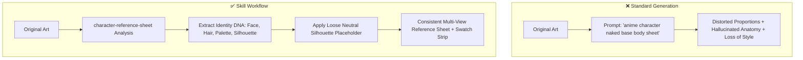

# 📋 Character Reference Sheet Generator

[](https://github.com/)
[](https://github.com/)
[](../LICENSE)
[](SKILL.md)

A specialized concept art and fan art (二创) preparation skill that deconstructs character illustrations into clean, reusable model sheets and reference turnaround templates. Designed for artists, illustrators, and animators who need to redraw characters in new outfits, poses, or scenes while strictly locking character identity and proportions.

---

## ⚖️ Before & After Comparison

| Factor | ❌ Before (Standard AI Generation / Naive Prompts) | ✅ After (With `character-reference-sheet`) |
|---|---|---|
| **Outfit Swapping Base** | Strips character into a skin-tight bodysuit, sexualized mannequin, or fabricated nude anatomy base | Retains loose, non-revealing silhouette placeholder matching the character's authentic volume and garment drape |
| **Identity Retention** | Facial identity drifts between angles; subtle markings, distinct horns, ears, or scars vanish | Explicit separation of permanent identity traits (face, hair, eyes, unique biology) from replaceable attire |
| **Proportions & Silhouette** | Body proportions morph (e.g. waist shrunk, head size altered, limbs lengthened or shortened) | Proportions strictly calibrated only from visible source evidence; no body reconstruction |
| **Missing Angle Handling** | Hallucinates or invents non-visible angles (e.g. fabricating intricate back designs with no reference) | Flags unreferenced angles as "Not Available from Source" unless clear visual continuity exists |
| **Color Fidelity** | Inconsistent color hues across subsequent fan art generations | Extracts an accurate color swatch strip directly sampled from primary, secondary, and accent tones |
| **Artistic Cleanliness** | Cluttered background artifacts, complex scenery, and conflicting atmospheric lighting | Clean neutral/flat background layout with designated callout zones for signature props & details |

### Visual Workflow Comparison



---

## ✨ Features

- **Identity DNA Extraction:** Maps facial features, eye reflections, hair silhouette, and immutable character traits into a structured identity specification.
- **Safety & Anatomy Protection:** Enforces non-revealing body placeholders—never infers anatomy hidden under clothing and never generates skin-tight morph suits.
- **Color Palette Callout:** Automatically extracts a 5-to-8 swatch hexadecimal/color strip for hair, skin tone, eyes, primary garment, and accent metalwork.
- **Turnaround Cleanliness:** Standardizes front-view pose, optional side elevation, and detail callouts against a neutral, flat studio backdrop.
- **Fan Art / Redraw Readiness:** Produces prompt parameters and visual blueprints optimized for re-dressing the character in alternate costumes or action stances.

---

## 📂 Repository Structure

```
character-reference-sheet/
├── SKILL.md                                  # Reference sheet generation logic, constraints & safety rules
└── README.md                                 # Documentation & Before/After comparison
```

---

## 🚀 Installation & Setup

### For Google Antigravity (AGY)
Copy the skill folder into your workspace or global Antigravity skills directory:
```bash
# Workspace level
mkdir -p .agent/skills
cp -r character-reference-sheet .agent/skills/

# Global level
cp -r character-reference-sheet ~/.gemini/skills/
```

### For Claude Code / Claude Desktop
Copy the skill folder into your Claude skills directory:
```bash
mkdir -p ~/.claude/skills
cp -r character-reference-sheet ~/.claude/skills/
```

---

## 💡 Example Trigger Prompts

Upload an existing character illustration and ask:
- *"Create a character reference sheet from this illustration so I can draw her in a winter coat without losing her face and hair style."*
- *"Generate a turnaround model sheet for this character with a clean color swatch strip and neutral background."*
- *"Extract the design specs and create a base redraw template for this anime OC, keeping the loose silhouette placeholder."*
- *"Decompose this character's visual identity for fan art redraws and outfit swaps."*

---

## 📄 License

This skill is distributed under the [MIT License](../LICENSE).
