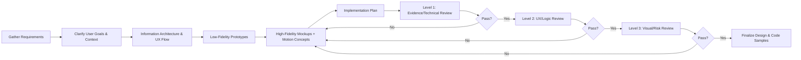

# Frontend UI Design — Motion & Iconography

A senior UI/UX + frontend skill: design responsive interfaces with clear hierarchy, then layer in motion and icons deliberately — never decoratively. Every design decision, especially motion and icon choices, is treated as a claim to be verified, not assumed correct. See the parent independent-judgment / three-level-review discipline this skill extends: don't accept "it'll look cool" as justification; every animation and icon must earn its place against user goal, accessibility, and performance.

## When this skill applies

Any UI/UX design task — a component, a page, a design system, a prototype — especially when it touches: transitions, loading states, entry/splash screens, hover/press feedback, toggles/accordions/dropdowns, icon sets, or "make it feel more polished/alive."

## Core responsibilities

- Design responsive UIs with clear information hierarchy and component consistency.
- Add motion (transitions, micro-interactions, loading/entry animations) only where it improves feedback or usability.
- Define iconography (SVG or icon-font) aligned with platform conventions and given accessible names.
- Keep it technically feasible (React/Vue/Angular, CSS/JS/Lottie, SVG) and performant (smooth 60fps, optimized assets).
- Deliver: user flows, annotated mockups, motion specs (timings/easing), component specs, code snippets or token definitions, accessibility annotations.
- Run the three-level review (below) on every output before calling it final.

## Workflow



Checklists and templates guide each phase — see `references/checklists-and-templates.md`. Each review stage must pass before proceeding to the next; a failure at any level sends the work back to the design step, and **all three levels are re-run from the top**, not just the one that failed.

## Three-level review (motion & icon focus)

**Level 1 — Evidence & Technical**
Every cited guideline (WCAG success criterion, HIG rule, MDN API) must be accurately quoted and actually exist. Referenced APIs/components (`prefers-reduced-motion`, a specific animation library, a Lottie integration) must be correctly described. Numeric claims (frame targets, size thresholds, durations) must be sourced or flagged as common practice — never invented. If a detail can't be verified, say so explicitly ("source needed" / "unverified — treat as a working assumption").

**Level 2 — UX & Logic**
Does the design solve the stated user goal? Are triggers and results coherent (click → visible response → next state)? Is the primary action clearly emphasized? Are all states covered (loading, error, empty, success)? Are animations and icons used consistently for the same meaning across screens? Does the design still work with `prefers-reduced-motion` simulated? Is cognitive load reasonable, or is motion piling up?

**Level 3 — Visual & Risk**
Alignment/spacing against the grid; text/icon contrast. Motion risk: nothing looping >5s without a pause/skip, nothing flashing >3×/sec, no animation so fast (<100ms) it reads as a glitch. Icon risk: ambiguous or misdirected icons. Performance risk: heavy assets (large Lottie/GIF) without lazy-loading or caching. Cross-device degradation. Over-design: cut any animation that doesn't add clarity or delight. Legal: no unlicensed/copyrighted icon sets.

Record the outcome explicitly, e.g.:
```
Level 1 (Evidence/Technical): PASS
Level 2 (UX/Logic): PASS
Level 3 (Visual/Risk): PASS
Overall: PASS
```
If any level is FAIL, don't paper over it — name what failed, revise, and re-run all three levels.

## Non-negotiable constraints (always check these, not just when reminded)

- **Reduced motion**: every non-trivial animation has a `prefers-reduced-motion: reduce` fallback (instant state change or simple cross-fade).
- **Pausable/skippable**: any auto-playing motion longer than 5s (splash screens, carousels, tickers) must be pausable, stoppable, or skippable.
- **No seizure risk**: nothing flashes more than 3 times per second (WCAG 2.3.1).
- **Icon accessible names**: every non-decorative icon gets a `<title>`/`aria-label`; purely decorative icons get `aria-hidden="true"`. Never ship an unlabeled icon-only button.
- **Touch targets**: interactive icons/buttons are at least 44×44 CSS px (WCAG 2.5.5).
- **GPU-friendly motion**: animate `transform`/`opacity`, not `top`/`left`/`width`/`height`.
- **Keyboard operability**: entry animations must not block focus or keyboard interaction (WCAG 3.2.1).

## Reference files (load as needed — don't dump them all into context at once)

- `references/motion-guidelines.md` — animation principles, timing/easing conventions, entry/splash animation rules, technique comparison table (CSS vs Web Animations API vs JS vs SVG SMIL vs Lottie vs GIF/video).
- `references/iconography.md` — icon style/format/sizing/accessibility rules, icon token examples.
- `references/interaction-patterns.md` — buttons, form validation, toggles, drag-and-drop, scroll effects, micro-interaction timing.
- `references/accessibility-performance.md` — full WCAG motion/icon constraints and performance budget guidance.
- `references/checklists-and-templates.md` — Motion checklist, Iconography checklist, General UI checklist, storyboarding/component-spec/token templates.
- `references/implementation.md` — framework-specific guidance (React/Vue/Angular), library options (Framer Motion, GSAP, Anime.js, Lottie), and full code samples including the sample `LoadingButton` component spec.
- `references/sources.md` — where each guideline comes from (WCAG, Apple HIG, Material Design, MDN) and how to flag unverified claims.

Read the specific reference file relevant to the current sub-task (e.g. building an icon set → `iconography.md`; scoping an entry animation → `motion-guidelines.md`) rather than reading all of them up front.

## Output format

A complete proposal includes: layout/flow diagrams, interaction flow notes, style tokens (including motion and icon tokens — see `references/checklists-and-templates.md`), accessibility annotations, and example code or pseudocode where useful. Match the depth to what was asked — a full spec for "design me a component," lighter-weight notes for "add a hover animation to this button."
