# 🔍 AI Image Restoration & HD Reconstruction

[](https://github.com/)
[](https://github.com/)
[](../LICENSE)
[](SKILL.md)

A rigorous image restoration, reconstruction, artifact-removal, and high-definition upscaling skill. Restores damaged, compressed, blurry, or low-resolution artwork, anime illustrations, historical scans, and game assets while maintaining absolute fidelity to the original subject.

Operates under a strict prime directive: **RESTORE EVIDENCE BEFORE INVENTING INFORMATION**. Enhancement must never become character redesign or medium conversion.

---

## ⚖️ Before & After Comparison

| Factor | ❌ Before (Generic AI Upscaler / "Beautify" Filters) | ✅ After (With `image-restoration-skill`) |
|---|---|---|
| **Facial Identity** | Alters facial geometry, replaces ethnic features, "beautifies" faces into generic uncanny AI models | Zero identity drift; strictly preserves authentic eye shape, facial proportions, age markers, and expressions |
| **Medium Preservation** | Converts 2D anime illustrations into weird semi-realistic oily renders; flattens 3D shader speculars | Strict medium locking: Anime stays anime with crisp clean linework; oil paintings retain brushstrokes; photos keep true film grain |
| **Artifact Treatment** | Sharpening filters sharpen JPEG 8x8 block boundaries into permanent harsh grids and bright edge halos | Targeted deblocking and artifact suppression before edge sharpening; zero ringing or halo artifacts |
| **Texture vs Noise** | Aggressive denoising wipes away intentional cloth weaves, paper grain, and hair textures into plastic mush | Selective frequency filtering: removes sensor noise while preserving organic fabric, hair strands, and background textures |
| **Linework Recovery** | Broken linework gets disconnected, blurred, or replaced with double edges | Topological line continuation: restores line integrity, taper weights, and clean cel-shaded contouring |
| **Missing Detail Handling** | Hallucinates random nonsensical objects or distorted hands in ambiguous blurry zones | Conservative reconstruction derived exclusively from surrounding context and architectural lines |

### Restoration Pipeline Comparison

```mermaid
flowchart TD
    subgraph BlindUpscale["❌ Standard Generic Upscale"]
        A1[Degraded / Blurry Input] --> B1[Single-Pass Generative Upscaler]
        B1 --> C1[Plastic Skin + Halos + Hallucinated Face Redesign]
    end

    subgraph GuidedRestoration["✅ Evidence-Guided Restoration"]
        A2[Degraded / Blurry Input] --> B2[Defect Analysis & Medium Classification]
        B2 --> C2[Deblocking, Denoising & Chromatic Cleanup]
        C2 --> D2[Topological Edge & Linework Restoration]
        D2 --> E2[Identity Lock & Conservative Detail Reconstruction]
        E2 --> F2[Clean, Faithful High-Definition Output]
    end
```



---

## ✨ Features

- **Evidence-First Reconstruction:** Prioritizes real pixel evidence over generative imagination to avoid unprompted reinterpretation.
- **Medium & Style Locks:**
  - **Anime / Manga / 2D:** Linework crispness, flat/cel-shading cleanliness, zero plastic 3D conversion.
  - **Photographic:** Authentic film grain, natural pore texture, realistic depth-of-field preservation.
  - **3D Render / Game Art:** Specular highlight recovery, normal map texture preservation, clean edge anti-aliasing.
- **Defect-Specific Tooling:** Comprehensive diagnostic checklists for motion blur, optical blur, JPEG blocking, color banding, aliasing, and color fading.
- **Subject Preservation Contract:** Hard guarantees locking facial landmarks, clothing patterns, jewelry, and environmental geometry.

---

## 📂 Repository Structure

```
image-restoration-skill/
├── SKILL.md                                  # Core restoration engine & identity preservation rules
├── README.md                                 # Documentation & Before/After comparison
└── references/
    ├── defect-checklist.md                   # Systematic checklist for blur, noise, compression & aliasing
    ├── style-modes.md                        # Mode-specific pipelines (Anime, Photo, 3D Render, Document)
    └── subject-preservation.md               # Detailed face, hair, fabric & texture preservation specs
```

---

## 🚀 Installation & Setup

### For Google Antigravity (AGY)
Copy the skill folder into your Antigravity workspace or global skills directory:
```bash
# Workspace level
mkdir -p .agent/skills
cp -r image-restoration-skill .agent/skills/

# Global level
cp -r image-restoration-skill ~/.gemini/skills/
```

### For Claude Code / Claude Desktop
Copy the skill folder into your Claude skills directory:
```bash
mkdir -p ~/.claude/skills
cp -r image-restoration-skill ~/.claude/skills/
```

---

## 💡 Example Trigger Prompts

- *"Restore this compressed, low-res anime screenshot to crisp 4K without changing the character's facial expression or hair style."*
- *"Remove the JPEG ringing and compression artifacts from this vintage scan while preserving the paper texture."*
- *"Deblur and upscale this character art, but make sure the lineart stays sharp and doesn't look like an AI plastic filter."*
- *"Analyze the defects in this uploaded image and provide a step-by-step restoration and upscaling prompt."*

---

## 📄 License

This skill is distributed under the [MIT License](../LICENSE).
