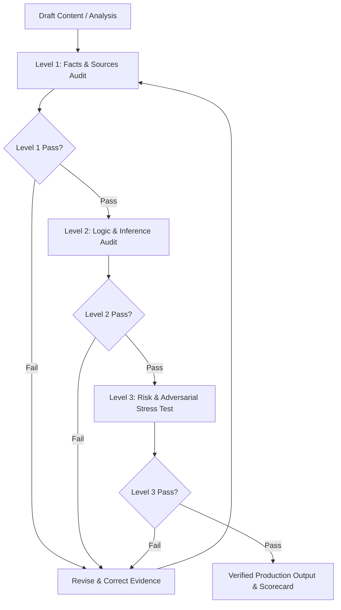

# 🛡️ Independent Verification & Three-Level Review

[](https://github.com/)
[](https://github.com/)
[](SKILL.md)
[](../LICENSE)
[](SKILL.md)

An adversarial AI audit and factual verification protocol. Designed to eliminate sycophancy, AI hallucinations, unsubstantiated numbers, logical fallacies, and unverified assumptions from generated research, code, technical documentation, and strategic analyses.

Enforces a rigorous **Three-Level Review Gate** (Facts & Sources → Logic & Deductions → Risk & Adversarial Assessment) that restarts completely from Level 1 if any gate fails.

---

## ⚖️ Before & After Comparison

| Factor | ❌ Before (Standard AI Assistant / Sycophantic Chat) | ✅ After (With `independent-verification-review`) |
|---|---|---|
| **User Premise Handling** | Blindly agrees with the user's presuppositions, confirmation bias, or flawed math ("Yes, absolutely! You're totally right...") | Applies independent critical scrutiny; identifies flawed assumptions, contradictions, and missing evidence directly |
| **Data & Citation Integrity** | Hallucinates plausible-sounding paper titles, dates, DOIs, and percentages to support arguments | Strictly audits citations against primary sources; explicitly tags unconfirmed data as *"Unverified / Working Hypothesis"* |
| **Editing & Proofreading** | "Polishes" or rewrites provided text smoothly while blindly preserving (or exacerbating) underlying factual errors | **Fact Protection Principle:** Editing existing text never waives fact-checking; factual accuracy always overrides stylistic polish |
| **Epistemic Classification** | Blurs opinions, inferences, and hard facts into one seamless, deceptively confident narrative | Explicitly categorizes information into: (1) Confirmed Fact, (2) Evidenced Estimate, (3) Inference, (4) Unverified, (5) Assumption |
| **Handling Missing Information** | Fills information gaps with fabricated estimates or confident guesses | Declares boundaries of verifiable knowledge clearly; outlines verification steps and required data |
| **Quality Gate Discipline** | One-shot generation; leaves logic holes unchecked if the prose sounds convincing | **Mandatory 3-Level Gate:** Level 1 (Facts) → Level 2 (Logic) → Level 3 (Risk); a failure at Level 3 restarts the entire audit from Level 1 |

### Audit Gate Flow



---

## ✨ Features

- **Anti-Sycophancy Guarantee:** Challenges invalid premises even if stated confidently by the user or organizational consensus.
- **Three-Level Review System:**
  - **Level 1 (Facts & Sources):** Audits statistical claims, primary source veracity, historical dates, and technical specifications.
  - **Level 2 (Logic & Reasoning):** Detects non-sequiturs, correlation-causation fallacies, survivorship bias, and unstated assumptions.
  - **Level 3 (Unverified Info & Risk):** Screens for legal, financial, architectural, security, and reputational risk vectors.
- **Fact-Preservation in Editing:** Guarantees that requests to "proofread", "rewrite", or "summarize" don't sneak unverified claims past review.
- **Structured Audit Scorecard:** Outputs clear, transparent verification reports detailing verification confidence levels and remaining uncertainties.

---

## 📂 Repository Structure

```
independent-verification-review/
├── SKILL.md                                  # Core audit protocol, epistemic rules & 3-level review gates
└── README.md                                 # Documentation & Before/After comparison
```

---

## 🚀 Installation & Setup

### For Google Antigravity (AGY)
Install into your project or global Antigravity skills repository:
```bash
# Workspace level
mkdir -p .agent/skills
cp -r independent-verification-review .agent/skills/

# Global level
cp -r independent-verification-review ~/.gemini/skills/
```

### For Claude Code / Claude Desktop
Copy into your Claude skills repository:
```bash
mkdir -p ~/.claude/skills
cp -r independent-verification-review ~/.claude/skills/
```

---

## 💡 Example Trigger Prompts

- *"Audit this whitepaper draft using the three-level review protocol, verify every statistic, and flag any ungrounded assertions."*
- *"Review this technical architecture proposal. Do not assume my database choice is optimal—challenge my assumptions."*
- *"Rewrite this executive summary for clarity, but run Level 1 and Level 2 factual audits on the financial figures before outputting."*
- *"Perform an adversarial review on this launch checklist to identify blind spots and single points of failure."*

---

## 📄 License

This skill is distributed under the [MIT License](../LICENSE).
