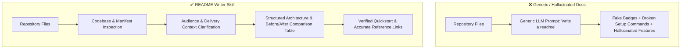

# 📝 README Writer

[](https://github.com/)
[](https://github.com/)
[](../LICENSE)
[](SKILL.md)

A specialized documentation engineering skill that crafts clean, comprehensive, and production-grade `README.md` files for open-source repositories, developer tools, libraries, APIs, and AI Agent Skills.

Operates under a non-negotiable core rule: **Document what exists — don't invent it.** Prioritizes codebase factuality, verified installation commands, and clear visual hierarchy over generic AI fluff.

---

## ⚖️ Before & After Comparison

| Factor | ❌ Before (Ad-Hoc / Generic AI Generation) | ✅ After (With `readme-writer`) |
|---|---|---|
| **Factuality & Grounding** | Hallucinates fake CLI commands, unsupported npm/pip flags, and non-existent features | Reads real repository manifests (`package.json`, `setup.py`, `SKILL.md`) and only documents verified capabilities |
| **Badge Integrity** | Inundates the header with broken or fake Shields.io badges (fake coverage, non-existent CI builds, placeholder PyPI versions) | Ships only genuine badges corresponding to real infrastructure, license files, and verified dependencies |
| **Quick Start Accuracy** | Copy-pasting the quickstart results in shell errors, wrong file paths, or missing environment variables | Clear, runnable, copy-pasteable setup instructions verified against project scripts and requirements |
| **Information Architecture** | Disorganized walls of text without clear headings, user flows, or table of contents | Standardized technical hierarchy: Title → Summary → Badges → Before/After → Features → Architecture → Quickstart → Usage |
| **Audience Alignment** | Confuses end-user instructions with internal developer notes | Segmented documentation clearly addressing end users, integrating developers, and contributors |
| **Accessibility & Formatting** | Missing image alt text, broken relative file links, unformatted code blocks without language tags | Fully validated GitHub Flavored Markdown (GFM), syntax-highlighted code fences, and accessible image tags |

### Visual Impact Comparison



---

## ✨ Features

- **Codebase Manifest Inspection:** Parses `package.json`, `requirements.txt`, `pyproject.toml`, `.skill` files, and source code before drafting docs.
- **Before & After Impact Tables:** Automatically builds high-impact comparative tables showcasing the practical difference the software or skill delivers.
- **Agent Skill Specialization:** Built-in templates for Antigravity (AGY) and Claude Skills, including skill directory structures, trigger prompts, and model capabilities.
- **Zero Hallucination Protocol:** Clear placeholder flagging (`<!-- TODO: ... -->`) for missing details instead of fabricating licenses, URLs, or commands.

---

## 📂 Repository Structure

```
readme-writer/
├── SKILL.md                                  # Core documentation writing rules, structure templates & constraints
└── README.md                                 # Documentation & Before/After comparison
```

---

## 🚀 Installation & Setup

### For Google Antigravity (AGY)
Install into your project or global Antigravity skills repository:
```bash
# Workspace level
mkdir -p .agent/skills
cp -r readme-writer .agent/skills/

# Global level
cp -r readme-writer ~/.gemini/skills/
```

### For Claude Code / Claude Desktop
Copy into your Claude skills repository:
```bash
mkdir -p ~/.claude/skills
cp -r readme-writer ~/.claude/skills/
```

---

## 💡 Example Trigger Prompts

- *"Write a comprehensive README.md for this Python CLI tool, including installation instructions, usage examples, and a before/after comparison table."*
- *"Audit and modernize the existing README in this repository with clean badges, responsive layout, and clear architecture diagrams."*
- *"Document this new Claude/Antigravity skill following the standard agent skill specification."*

---

## 📄 License

This skill is distributed under the [MIT License](../LICENSE).
