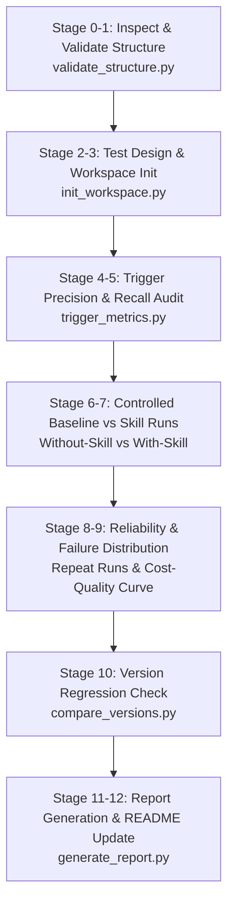

# 📊 Skill Performance Evaluator — Empirical Benchmarking & Regression Testing

[](https://github.com/lingjw02/personal-used-skill-library)
[](https://github.com/lingjw02/personal-used-skill-library)
[](SKILL.md)
[](../LICENSE)
[](SKILL.md)

An empirical testing and evaluation framework designed to benchmark AI Agent Skills (`SKILL.md` folders and `.skill` packages) with measured evidence instead of opinions. It measures trigger precision/recall, functional test pass rates, baseline (without-skill) vs with-skill lift, reliability across repeat runs, version-to-version regression checks, token cost vs quality trade-offs, and failure mode distribution.

It answers the core engineering question: **"What does this skill actually improve, under what conditions does it fail, and did the new version regress?"**

---

## ⚖️ Before & After Comparison

| Factor | ❌ Subjective Skill Assessment | ✅ Empirical `skill-performance-evaluator` Framework |
|---|---|---|
| **Quality Claims** | Hand-waving assertions ("This skill produces great code", "high quality prompts") | Measured quantitative metrics (pass rate %, trigger precision/recall %, token lift ratio) |
| **Baseline Lift** | Assumes the skill helps without testing the agent without it | Controlled A/B testing: Baseline (No-Skill) vs Treatment (With-Skill) on identical task sets |
| **Trigger Reliability** | Guesses trigger behavior from description text | Automated trigger suite testing: True Positives, False Positives, False Negatives on realistic queries |
| **Regression Detection** | Deploys updates blind; unnoticed degradation in edge-case handling | Automated diffing between version runs (`v1` vs `v2`) to catch performance and reliability drops |
| **Evidence Discipline** | Blurs opinions with facts | Strict epistemic tags: `FACT`, `MEASURED RESULT`, `INFERENCE`, `RECOMMENDATION`, `UNCERTAINTY` |

---

## 🔄 12-Stage Evaluation Pipeline



---

## 📂 Repository Structure

```
skill-performance-evaluator/
├── SKILL.md                                  # Core evaluation protocol & 12-stage test pipeline
├── README.md                                 # Documentation & empirical benchmarking guide
├── scripts/
│   ├── init_workspace.py                     # Initializes <skill>-eval-workspace/ directory
│   ├── validate_structure.py                 # Validates SKILL.md frontmatter, schema, and bundled assets
│   ├── trigger_metrics.py                    # Evaluates trigger precision, recall, and false-positive rates
│   ├── aggregate_runs.py                     # Aggregates run-record JSON logs into summary metrics
│   ├── compare_versions.py                   # Diffs version metrics to detect regressions
│   ├── generate_report.py                    # Generates evidence-based Markdown & JSON reports
│   ├── import_trigger_eval.py                # Imports external test cases into standard schema
│   ├── selfcheck.py                          # Validates evaluation workspace integrity
│   └── _common.py                            # Shared data models, schemas, and math helpers
├── references/
│   ├── test-design.md                        # Task design guidelines for agent evals
│   ├── execution.md                          # Execution harness rules & environment isolation
│   ├── comparison-regression.md              # Regression tolerance thresholds & diff logic
│   ├── failure-analysis.md                   # Categorization of agent error modes
│   ├── metrics.md                            # Metric definitions (Lift, Precision, Flakiness)
│   ├── readme-rules.md                       # Rules for evidence-backed skill documentation
│   └── schemas.md                            # JSON schemas for run records and evaluation results
├── assets/
│   ├── templates/                            # JSON templates for evals, narratives, and run records
│   └── examples/                             # Sample evaluation suites
└── tests/
    └── run_selftest.py                       # Self-verification suite for bundled eval scripts
```

---

## 🚀 Installation & Setup

### For Google Antigravity (AGY)
```bash
# Workspace level
mkdir -p .agent/skills
cp -r skill-performance-evaluator .agent/skills/

# Global level
cp -r skill-performance-evaluator ~/.gemini/antigravity-cli/builtin/skills/
```

### For Claude Code / Claude Desktop / Cursor
```bash
mkdir -p ~/.claude/skills
cp -r skill-performance-evaluator ~/.claude/skills/
```

---

## 💡 Example Trigger Prompts

- *"Benchmark the `ui-ux-tester` skill against a no-skill baseline on 5 realistic test applications."*
- *"Evaluate trigger precision and recall for `ai-project-architect` using 20 positive and negative queries."*
- *"Run a regression test comparing `v1.0` and `v2.0` of `character-illustration-reverse-engineer`."*
- *"Generate an evidence-backed README and performance scorecard for `live2d-asset-prep`."*

---

## 📄 License

This skill is distributed under the [MIT License](../LICENSE).
