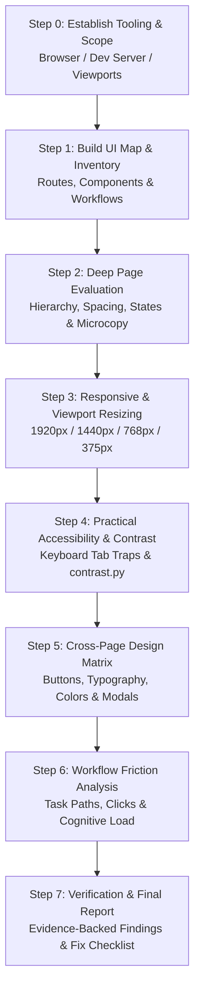

# 🎯 UI/UX Tester — Autonomous Interface & Usability Auditing

[](https://github.com/lingjw02/personal-used-skill-library)
[](https://github.com/lingjw02/personal-used-skill-library)
[](SKILL.md)
[](../LICENSE)
[](SKILL.md)

An autonomous UI/UX evaluation skill that drives running web applications, dashboards, and client interfaces using mouse, keyboard, and viewport resizing. It evaluates interfaces like a professional design auditor and usability engineer, delivering evidence-based reports with severity-rated findings, design consistency matrices, practical accessibility measurements, and actionable code fixes.

While functional QA asks **"Does it work?"**, `ui-ux-tester` asks **"Can users understand, navigate, and comfortably use the system without friction?"**

---

## ⚖️ Before & After Comparison

| Dimension | ❌ Standard LLM UI Critique / Static Code Review | ✅ Autonomous `ui-ux-tester` Protocol |
|---|---|---|
| **Testing Medium** | Inspects raw markup/CSS in the editor or looks at a single static screenshot | Actively drives the rendered, running interface via browser automation or computer-use tools |
| **Interaction Coverage** | Speculates whether buttons and modals work based on code inspection | Tests hover, click, active, focus, disabled, loading, empty, and error states interactively |
| **Responsive Verification** | Reads `@media` queries in stylesheets and guesses layout breakpoints | Dynamically resizes the viewport (1920px, 1440px, 768px, 375px) to catch clipping, wrapping, and overflow |
| **Accessibility Audit** | Quotes WCAG guidelines theoretically without real measurements | Real keyboard tabbing (`Tab`, `Escape`, arrow keys), focus indicators, and measured contrast using `contrast.py` |
| **Cross-Page Cohesion** | Evaluates pages in isolation; fails to notice inconsistent design tokens | Compiles a **Design Consistency Matrix** comparing buttons, typography, radius, and spacing across all views |
| **Report Actionability** | Vague advice ("improve sidebar layout", "modernize styling") | Concrete developer-ready recommendations with exact CSS tokens, reproduction steps, and severity ratings |

---

## 🔄 Autonomous UI/UX Testing Workflow



---

## ✨ Core Audit Dimensions

### 1. Visual Hierarchy & Spatial Rhythm
- **Primary vs Secondary Affordance:** Verifies that views present exactly one primary action and that interactive elements are immediately distinguishable from static content.
- **Alignment & Grid Rhythm:** Identifies edge misalignment, irregular margins/padding, clipping, and unintended overlapping layers (e.g. sticky headers obscuring modals).

### 2. State Design Matrix
Verifies that critical interactive elements implement all essential states:
- `Default` → Clear visual affordance and affordance contrast.
- `Hover & Focus` → Visible pointer feedback and high-contrast keyboard focus indicators.
- `Active / Pressed` → Immediate tactile visual feedback.
- `Disabled` → Distinguishable disabled appearance with explanatory tooltip/context.
- `Loading & Asynchronous` → Spinners/skeletons that prevent double submission.
- `Error & Empty` → Clear inline contextual error messages and constructive empty states.

### 3. Responsive Breakpoint Stress Testing
Tests the interface across 4 distinct viewport classes:
- **Large Desktop (1920px):** Content stretching, excess empty margins, ultrawide readability.
- **Laptop (1440px / 1366px):** Standard desktop layout and vertical fold constraints.
- **Tablet (768px):** Navigation collapsing, touch target scaling, multi-column wrap.
- **Mobile (375px / 320px):** Drawer navigation, modal scrollability, touch target hitboxes (min 44×44px), horizontal scroll leaks.

### 4. Practical Accessibility & Color Contrast
- Bundles `scripts/contrast.py` for WCAG luminance and contrast ratio calculations against background surfaces.
- Tests keyboard focus trapping in modal dialogs and proper `Escape` dismissal.
- Validates accessible labels for icon-only buttons (`aria-label`, `<title>`).

### 5. Cross-Page Design Consistency Matrix
Audits the application to catch fragmented component implementations:

| Component | Page A | Page B | Page C | Consistent | Recommendation |
|---|---|---|---|:---:|---|
| Primary Button | `#2563EB` 8px radius | `#2563EB` 8px radius | `#1D4ED8` 4px radius | ❌ | Standardize on 8px radius token |
| Modal Dismissal | Esc + Overlay click | Close icon only | Esc + Overlay click | ❌ | Unify backdrop dismiss pattern |

---

## 📂 Repository Structure

```
ui-ux-tester/
├── SKILL.md                                  # Core autonomous UI/UX auditing specification
├── README.md                                 # Documentation & test methodology
├── scripts/
│   └── contrast.py                           # WCAG luminance & contrast ratio calculation utility
└── references/
    ├── checklists.md                         # Exhaustive probes: visual, spacing, states, a11y, responsive
    ├── measurement-snippets.md               # JavaScript snippets to extract computed CSS & touch target sizes
    └── report-template.md                    # Standardized evidence-based UI/UX test report template
```

---

## 🚀 Installation & Setup

### For Google Antigravity (AGY)
Drop into your project workspace or global Antigravity skills repository:
```bash
# Workspace level
mkdir -p .agent/skills
cp -r ui-ux-tester .agent/skills/

# Global level
cp -r ui-ux-tester ~/.gemini/antigravity-cli/builtin/skills/
```

### For Claude Code / Claude Desktop / Cursor
```bash
# Claude Code / Desktop
mkdir -p ~/.claude/skills
cp -r ui-ux-tester ~/.claude/skills/
```

---

## 💡 Example Trigger Prompts

- *"Run a UI/UX audit on our local dev server at http://localhost:3000 and check user onboarding flow."*
- *"Test our dashboard for mobile responsiveness at 375px and flag any clipped controls or layout breaks."*
- *"Audit the checkout workflow for usability friction, missing loading states, and form validation UX."*
- *"Verify accessibility and color contrast on our new dark mode theme using contrast.py."*
- *"Generate a design consistency matrix comparing our settings, billing, and profile views."*

---

## 📄 License

This skill is distributed under the [MIT License](../LICENSE).
